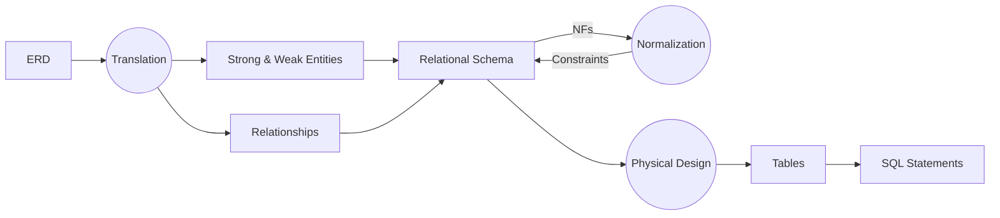

[toc]

# A Simple Flow

This is a simplified version of the development of the design of a database. And we are currently working roughly according to this flowchart.



# ER Diagram

Check the simplest version of ERD on develop branch on GitHub. This ERD is based on the starter code and our original ERD. With the ERD ready to go, we can begin the translation and walk into the next stage: logical design.

# Logical Design

## STEP 1 Derive Relation s for Logical Data Model

### Strong Entities

1. **Buyer**(<u>buyerId</u>, email, password, telNo, firstName, lastName, street, city, postcode, age, gender, level)

2. **Seller**(<u>sellerId</u>, email, password, telNo, firstName, lastName, street, city, postcode, age, gender, level)


1. ~~**Auction**(<u>auctionId</u>, auctionStatus, category, title, auctionDescription, startingPrice, reservePrice, increments, startDate, endDate, topBidNo)~~ (It's updated after mapping the relationship.)

2. **Bid**(<u>bidNo</u>, bidStatus, bidAmount, bidTime)

### Weak Entities

<span id="weak entity">I'm not sure whether **Auction** and **Bid** should be assigned to weak entities.</span>

### Relationship

1. Buyer watches Auction 【\*:\* relationship】--> **Watching**(==<u>buyerId</u>==, ==<u>auctionNo</u>==)

2. Seller launches Auction 【1:\* relationship】--> update **Auction**(<u>auctionId</u>, auctionStatus, category, title, auctionDescription, startingPrice, reservePrice, increments, startDate, endDate, topBidNo, ==sellerId==)

3. Buyer creates Bid on Auction 【complex relationship】--> **CreateBid**(==<u>bidNo</u>==, ==buyerId==, ==auctionNo==)

<span id="relationship">Do we need relationship between Buyer & Seller; Seller & Bid? (They are not described on the ER diagram.)</span>

---

SO now we have 6 relational schemas with <u>PK</u> and ==FK==:

1. **Buyer**(<u>buyerId</u>, email, password, telNo, firstName, lastName, street, city, postcode, age, gender, level)
2. **Seller**(<u>sellerId</u>, email, password, telNo, firstName, lastName, street, city, postcode, age, gender, level)
3. **Auction**(<u>auctionId</u>, auctionStatus, category, title, auctionDescription, startingPrice, reservePrice, increments, startDate, endDate, topBidNo, ==sellerId==)
4. **Bid**(<u>bidNo</u>, bidStatus, bidAmount, bidTime)
5. **CreateBid**(==<u>bidNo</u>==, ==buyerId==, ==auctionNo==)
6. **Watching**(==<u>buyerId</u>==, ==<u>auctionNo</u>==)

## STEP2 Validate Relations Using Normalization

> The purpose of normalization is to ensure that the set of relations has a minimal yet sufficient number of attributes necessary to support the data requirements of the enterprise. [^Normalization]


1NF

We have **telNo [1..2]** which violates the 1NF, so we need to break the table. So we have two new tables:

1. BuyerTel(<u>buyerId</u>, telNo, backupTelNo)
2. SellerTel(<u>sellerId</u>, telNo, backupTelNo)

2NF

​	No Violation.

3NF

​	<span id='3NF'>auctionStatus & endDate?</span>

BCNF

​	No Violation.

## STEP3 Validate Relations against User Transactions

This step involves that concept of **Transactions**, which is introduced in the following week. I do not really userstand what transactions do we have and what does it mean, according to the book, "perform a transaction manually". So just skip this step and return after the next week's lectures and Q&A.

## STEP4 Check Integrity Constraints

- [x] Required data: whether allowed to hold nulls 

- [x] Attribute domain constraints
  
  - [ ] <span id='domain constraints'>The domain of **Category**,  **level** and **increments** yet to be decided</span>
  
- [x] Entity integrity: PK must be unique and not null

- [x] Referential integrity

  - [x] Whether nulls are allowed for foreign keys
  - [x] Ensure referential integrity
    - NO ACTION
    - CASCADE
    - SET NULL
    - SET DEFAULT
    - NO CHECK

- [x] General constraints

  Not necessary so far, maybe in the future.

After checking all these constraints, they should be documented into a data dictionary for reference when conducting physical design. To simplify, I just directly record the integrity constraints in following Tables.

## STEP5 Review Logical Data Model with User

It's about the users' view. For our project, each of us is considered the user hahaha. This step involves possible multiple user views, which means that we need use**Seller View** and **Buyer View** to check something afterwards. (Refer to the textbook P544)

## STEP6 Merge Logical Data Models into Global Model (optional)

## STEP7 Check for Future Growth

Anyway, skip step 5-7 for now.

# Physical Design

Once completed the above logical design, we can transform it into tables and write SQL statements.

## Datsbase Name

auction_house

## Tables

### Buyer

|   Field    |     Type     | Null |    Key    | Default |                  Extra                  |
| :--------: | :----------: | :--: | :-------: | :-----: | :-------------------------------------: |
|  buyerId   |     int      |  NO  |  Primary  |         |     unsigned; auto_increment by one     |
|   email    | varchar(255) |  NO  | Candidate |         |                                         |
|  password  | varchar(255) |  NO  |           |         | md5 encryption, ==other requirements?== |
| firstName  | varchar(35)  |  NO  |           |         |                                         |
|  lastName  | varchar(35)  |  NO  |           |         |                                         |
|  ~~age~~   |   tinyint    |  NO  |           |         |                unsigned                 |
| ~~gender~~ |   char(1)    | YES  |           |  NULL   |                  M, F                   |
|   level    |   tinyint    |  NO  |           |    0    |                unsigned                 |

### BuyerAddress

|   Field   |    Type     | Null |   Key   | Default |                            Extra                             |
| :-------: | :---------: | :--: | :-----: | :-----: | :----------------------------------------------------------: |
| addressId |     int     |  NO  | Primary |         |               unsigned; auto_increment by one                |
|  street   | varchar(35) |  NO  |         |         |                                                              |
|   city    | varchar(35) |  NO  |         |         |                                                              |
| postcode  | varchar(8)  |  NO  |         |         |                        6 ≦ length ≦ 8                        |
|  buyerId  |     int     |  NO  | Foreign |    -    | buyer(buyerId); ON UPDATE CASCADE ON DELETE NO ACTION;unsigned |

### BuyerTel

|    Field    |    Type     | Null |       Key        | Default |                            Extra                             |
| :---------: | :---------: | :--: | :--------------: | :-----: | :----------------------------------------------------------: |
|   buyerId   |     int     |  NO  | Primary, Foreign |    -    | buyer(buyerId); ON UPDATE CASCADE ON DELETE NO ACTION;unsigned |
|    telNo    | varchar(15) | YES  |                  |  NULL   |                       10 ≦ length ≦ 15                       |
| backupTelNo | varchar(15) | YES  |                  |  NULL   |                       10 ≦ length ≦ 15                       |

### Seller

|   Field   |     Type     | Null |    Key    | Default |              Extra              |
| :-------: | :----------: | :--: | :-------: | :-----: | :-----------------------------: |
| sellerId  |     int      |  NO  |  Primary  |         | unsigned; auto_increment by one |
|   email   | varchar(255) |  NO  | Candidate |         |                                 |
| password  | varchar(255) |  NO  |           |         |         md5 encryption          |
|   telNo   | varchar(15)  | YES  |           |  NULL   |        10 ≦ length ≦ 15         |
| firstname | varchar(35)  |  NO  |           |         |                                 |
| lastname  | varchar(35)  |  NO  |           |         |                                 |
|  street   | varchar(35)  |  NO  |           |         |                                 |
|   city    | varchar(35)  |  NO  |           |         |                                 |
| postcode  |  varchar(8)  |  NO  |           |         |         6 ≦ length ≦ 8          |
|    age    |   tinyint    |  NO  |           |         |            unsigned             |
|  gender   |   char(1)    | YES  |           |  NULL   |              M, F               |
|   level   |   tinyint    |  NO  |           |    0    |            unsigned             |

### SellerAddress

|   Field   |    Type     | Null |   Key   | Default |                            Extra                             |
| :-------: | :---------: | :--: | :-----: | :-----: | :----------------------------------------------------------: |
| addressId |     int     |  NO  | Primary |         |               unsigned; auto_increment by one                |
|  street   | varchar(35) |  NO  |         |         |                                                              |
|   city    | varchar(35) |  NO  |         |         |                                                              |
| postcode  | varchar(8)  |  NO  |         |         |                        6 ≦ length ≦ 8                        |
| sellerId  |     int     |  NO  | Foreign |    -    | seller(sellerId); ON UPDATE CASCADE ON DELETE NO ACTION;unsigned |

### SellerTel

|    Field    |    Type     | Null |       Key        | Default |                            Extra                             |
| :---------: | :---------: | :--: | :--------------: | :-----: | :----------------------------------------------------------: |
|  sellerId   |     int     |  NO  | Primary, Foreign |    -    | buyer(buyerId); ON UPDATE CASCADE ON DELETE NO ACTION;unsigned |
|    telNo    | varchar(15) | YES  |                  |  NULL   |                       10 ≦ length ≦ 15                       |
| backupTelNo | varchar(15) | YES  |                  |  NULL   |                       10 ≦ length ≦ 15                       |

### Auction

|       Field        |    Type     | Null |   Key   |     Default     |                            Extra                             |
| :----------------: | :---------: | :--: | :-----: | :-------------: | :----------------------------------------------------------: |
|     auctionNo      |     int     |  NO  | Primary |      NULL       |               unsigned; auto_increment by one                |
|   auctionStatus    |   Boolean   |  NO  |         |      True       |                                                              |
|      category      | varchar(35) | NOT  |         |      Other      |                           trigger                            |
|       title        | varchar(35) |  NO  |         | Unnamed Auction |                                                              |
| auctionDescription | text(2000)  | YES  |         |                 |                                                              |
|   startingPrice    |     int     |  NO  |         |                 |                           unsigned                           |
|    reservePrice    |     int     | YES  |         |                 |                           unsigned                           |
|     increments     |     int     |  NO  |         |        1        |                           unsigned                           |
|     startDate      |  datetime   |  NO  |         |      today      |                                                              |
|      endDate       |  datetime   |  NO  |         |                 |                          \>= today                           |
|    ~~topBidNo~~    |     int     |  NO  | Foreign |                 |            ON UPDATE CASCADE ON DELETE NO ACTION             |
|      sellerId      |     int     |  NO  | Foreign |                 | Seller(sellerId); ON UPDATE CASCADE ON DELETE NO ACTION; unsigned |

### Bid

|   Field   |   Type   | Null |   Key   | Default |              Extra              |
| :-------: | :------: | :--: | :-----: | :-----: | :-----------------------------: |
|   bidNo   |   int    |  NO  | Primary |  NULL   | unsigned; auto_increment by one |
| bidStatus | Boolean  |  NO  |         |  True   |                                 |
| bidAmount |   int    |  NO  |         |         |            unsigned             |
|  bidTime  | datetime |  NO  |         |         |          current time?          |

### CreateBid

|   Field   | Type | Null |   Key   | Default |                            Extra                             |
| :-------: | :--: | :--: | :-----: | :-----: | :----------------------------------------------------------: |
|   bidNo   | int  |  NO  | Primary, Foreign |    -    |  bid(bidNo); ON UPDATE CASCADE ON DELETE NO ACTION;unsigned  |
| auctionNo | int  |  NO  | Foreign |    -    | auctionNo(auctionNo); ON UPDATE CASCADE ON DELETE NO ACTION;unsigned |
|  buyerId  | int  |  NO  | Foreign |    -    | buyer(buyerId); ON UPDATE CASCADE ON DELETE NO ACTION;unsigned |

### Watching

|   Field   | Type | Null |   Key   | Default |                            Extra                             |
| :-------: | :--: | :--: | :-----: | :-----: | :----------------------------------------------------------: |
|  buyerId  | int  |  NO  | Primary, Foreign |    -    | buyer(buyerId); ON UPDATE CASCADE ON DELETE NO ACTION;unsigned |
| auctionNo | int  |  NO  | Primary, Foreign |    -    | auctionNo(auctionNo); ON UPDATE CASCADE ON DELETE NO ACTION;unsigned |

# MySQL Examples

1. CREATE TABLE example:

   You need to be aware of:

   - Data type
     - CHAR & VARCHAR
     - numeric datatype
   - DEFAULT
     - Function
   - NOT NULL
   - Domain constraints
   - Auto increment & Primary key (Use ‘PRIMARY KEY’ keyword after an attribute or shown as following)
   - Foreign keys
     - Constraints **CHECK only works for version beyond MySQL 8**
   - MySQL Engines

   ```sql
   CREATE TABLE table_name (
       columnName DATATYPE,
       studentId int NOT NULL AUTO_INCREMENT,
       firstName varchar(255),
       city varchar(255) DEFAULT 'London',
       /* use functions to insert system values */
       registerDate date \date DEFAULT GETDATE(),
       gender varchar(255),
       
       CHECK (gender IN ('M', 'F')),
       
       PRIMARY KEY (studentid),
       FOREIGN KEY (colunmnName)
       	REFERENCES tableName(colunmnName)
       	ON {DELETE | UPDATE} {CASCADE | SET NULL | SET DEFAULT | NO ACTION},
       ENGINE = [INNODB, MYISAM]
   );
   ```

2. List Info about Tables

   ```sql
   SHOW TABLES;
   DESCRIBE table_name;
   SHOW CREATE TABLE table_name;
   ```

3. INSERT INTO example:

   ```sql
   INSERT INTO table_name (
       column1,
       column2,
       ...
   )
   OUTPUT INSERTED.*
   VALUES (
       value1,
       value2,
       ...
   );
   ```

4. clean up a table

   ```sql
   TRUNCATE TABLE table_name;
   DELETE FROM table_name;
   ```


# Q

1. [Weak Entities?](#weak entity)
2. [Is there a **Fan trap** between *buyer* and *seller*?](#relationship)
3. [Shall we allow **Category** hold NULL?](#category null) *
4. [ Values of  **Category**, **Level**...](#domain constraints) *
5. TEXT or VARCHAR for **auctionDescription**? *
6. Individual address table? *
7. DATETIME or TIMESTAMP？
8. [Does auctionStatus & endDate violate 3NF?](#3NF)
9. Data input check *
10. Shall we use `DEFAULT` together with `NOT NULL`？
11. `OUTPUT` in MySQL?
12. **INDEX**


## References

[^Normalization]: Connolly, T., & Begg, C. (2015). *Database systems : A practical approach to design, implementation, and management* (pp.539)