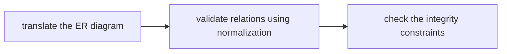

# Design Report

[toc]

<div style="page-break-after: always;"></div>

## URL

- [Youtube video]()
- [Azure Web](https://auctionfor13.azurewebsites.net/)

## Entity Relationship Diagram


### Summary of the ER diagram
There are

- four Entity types: Buyer, Seller, Auction, Bid;

- four Relationship types: seller **launches** auction, buyer **watches** auction, buyer **wins** auction,  buyer **creates** bid for auction.

And there is no fan trap nor chasm trap in this ER diagram.

### Assumptions about the processes that use the data

#### Data used in a user’s account

There are two kinds of users: buyer and seller. Attributes are divided into two types of data: one requiring user input, including <font color='blue'>[email]</font>, <font color='blue'>[password]</font>, <font color='blue'>[telephone number]</font>, <font color='blue'>[name]</font>, <font color='blue'>[address]</font>, and one assigned by the system, including <font color='blue'>[user id]</font> and <font color='blue'>[user level]</font>. When registering as a new user, a user needs to choose to become a buyer or a seller, the system will assign him a corresponding id (<font color='blue'>[buyerId]</font> or <font color='blue'>[sellerId]</font>), which is auto-incremented by one. For all users, one email can only be used once. Each time when a user logs in, <font color='blue'>[email]</font> is used to determine the user type and <font color='blue'>[password]</font> is used to verify the log-in process. The default value of <font color='blue'>[user level]</font> is 0. Finally, <font color='blue'>[email]</font>, <font color='blue'>[name]</font>, <font color='blue'>[telephone number]</font>, <font color='blue'>[address]</font> and <font color='blue'>[user level]</font> are displayed on the account page.

#### Data used for a buyer’s privilege

A buyer can browse the auctions and search for matching results. <font color='blue'>[auctionNo]</font> and other relevant attributes are used to support the search. Then he can bid on an auction and update the bid before the auction ends. Every time when the buyer places a new bid, he needs to input <font color='blue'>[bidAmount]</font>. An <font color='blue'>[bidNo]</font> will be generated automatically. The buyer can watch an auction where <font color='blue'>[auctionNo]</font> and <font color='blue'>[buyerId]</font> are used. When he is outbid or there is an update on what he is watching, an email including the information of the highest bid will be sent to the buyer. By using the bid history and the current bids of other buyers, the system can get the recommended item's <font color='blue'>[bidNo]</font> and push the item's other attributes to the buyer.

#### Data used for a seller’s privilege
A seller can also browse the auctions and search for matching results. Besides, he can create auctions by inputting <font color='blue'>[title]</font>, <font color='blue'>[category]</font>, <font color='blue'>[description]</font>, <font color='blue'>[price]</font>, <font color='blue'>[time]</font>. There is an auto-incremented <font color='blue'>[auctionNo]</font>. The number is also used when the seller checks his listings of auctions. 

#### Data used on auction process by the system
The system keeps checking the <font color='blue'>[endDate]</font> of each auction, along with the <font color='blue'>[reservePrice]</font>, <font color='blue'>[bidAmount]</font> in order to change the <font color='blue'>[auctionStatus]</font>, <font color='blue'>[bidStatus]</font> and select the winner. This is an AND operation between multiple attributes.

## Database Schema
From here we begin the logical design. There are three steps, 



### Step 1 Derive Relations for Logical Data Model

First, for each strong entity, a relation is created including all the simple attributes of that entity. After translating entities, we translate the relationship, while the primary key and alternate and foreign key(s) and references of foreign key(s) are identified.

We have four strong entities and no weak entities since each of them always has a primary key and is not dependent on any other entity (however, without the surrogate key, Auction and Bid can be viewed as weak entities. So it depends.) Four strong entities are: **Buyer, Selle, Auction, Bid**.


We have four relationship types: 

|Relationship from ERD|Relationship Type|
|:---:|:---:|
|Buyer watches Auction|Many-to-many (\*:\*) binary relationship|
|Buyer wins Auction|One-to-many (1:\*) binary relationship|
|Seller launches Auction|One-to-many (1:\*) binary relationship|
|Buyer creates Bid on Auction|complex relationship|


- For the \*:\* binary relationship, we create relations ‘Watching’ to represent the relationship which includes all corresponding attributes (buyerId, auctionNo) that are part of the relationship.
- For the two 1:\* binary relationship types, we designate 1) Buyer as the parent entity and the Auction as the child entity； 2) Seller as the parent entity and the Auction as the child entity. So we add foreign keys into the relation representing Auction and reference the foreign key (buyerId) to buyer(buyerId) and (sellerId) to Seller(sellerId).

- For the complex relationship, we need an individual relation CreateBid to represent the relationship and include all relevant attributes (bidNo, buyerId, auctionNo). The attribute bidNo, as a foreign key, also represents “many” relationships, so it acts as the primary key.

Next, for multi-valued attributes, telNo\[1..2\], we split it into two attributes: telNo and backupTelNo.

Finally we have six shcemas (example: **schema**(<u>primary or alternate keyt</u>, ==foreign key==)):

1. **Buyer**(<u>buyerId</u>, <u>email</u>, password, firstName, lastName,telNo, backupTelNo, street, city, postcode)
**Primary Key** buyerId
**Alternate Key** email

2. **Seller**(<u>sellerId</u>, <u>email</u>, password, firstName, lastName, telNo, backupTelNo, street, city, postcode)
**Primary Key** sellerId
**Alternate Key** email

3. **Auction**(<u>auctionId</u>, auctionStatus, category, title, auctionDescription, startingPrice, reservePrice, increments, startDate, endDate, topBidNo, ==sellerId==, ==buyerId==)
**Primary Key** auctionId
**Foreign Key** sellerId references Seller(sellerId)
**Foreign Key** buyerId references buyer(buyerId)

4. **Bid**(<u>bidNo</u>, bidStatus, bidAmount, bidTime)
**Primary Key** bidNo

5. **CreateBid**(==<u>bidNo</u>==, ==buyerId==, ==auctionNo==)
**Primary Key** bidNo
**Foreign Key** bidNo references Bid(bidNo)
**Foreign Key** buyerId references Buyer(buyerId)
**Foreign Key** auctionNo references auction(auctionNo)

6. **Watching**(==<u>buyerId, auctionNo</u>==)
**Primary Key** (buyerId, auctionNo)
**Foreign Key** buyerId references Buyer(buyerId)
**Foreign Key** auctionNo references auction(auctionNo)


### Step 2 Validate relation using normalization
The database schema is in third normal form, see [Part Normalization](#Normalization) for detailed analysis.

### Step 3 Check integrity constraints
We consider Required data, Attribute domain constraints, Entity integrity, and Referential integrity. 

Most attributes are not allowed to hold nulls except ‘backupTel’ and ‘reservePrice’. Domain constraints apply for ‘category’ since we only allow sellers to add auctions under certain categories. Entity integrity ensures that each PK must be unique and not null. For referential integrity, we apply **ON UPDATE CASCADE ON DELETE NO ACTION** for all foreign keys.

After checking all these constraints, we documented everything into a data dictionary for reference when conducting physical design.

## Normalization 

There are in total six schemas. First of all, all schemas don’t contain attributes that allow for multiple values in one cell. It means that all schemas are in 1NF. For watching and winner schema, there contains only a composite primary key which makes the schema in 3NF. 

For buyer schema, its primary key is buyerId and it is not a composite key, which makes the schema in 2NF. For every other attribute, there is no one that depends on a non-primary key. Buyer’s email, password, name, number and address are independent from each other. As a result, the schema is in 3NF with no transitive dependency. The same logic goes for the seller skema.

For auction schema, its primary key is auctionId and it is not a composite key, which makes the schema in 2NF. Category, title, auctionDescription, startingPrice, reservePrice, endDate are independent attributes that are input by sellers when creating the auction. AuctionStatus and startDate are determined by real time. The result is a schema in 3NF.

Finally, for createBid schema, its primary key is bidNo and the rest attributes are foreign keys which have no dependency between them. For bid schema,  bidAmount and bidTime are independent value input by the seller when placing a bid. The bidStatus is determined by other bids which have no relation with the attributes in the schema.

## Physical Design

Based on the schema, we further consider the usage of them in terms of frequency and resource. As the contacting method of buyer or seller is relatively less used during daily operations, we would like to separate them from the Buyer and Seller schema. Meanwhile, a foreign key ‘buyerId’ is used to connect buyer and buyerContact. In the same way, we have the Winner table. After the split, some of our tables have been changed and some new tables have been added, as follows:

- **Buyer**(<u>buyerId</u>, <u>email</u>, password, firstName, lastName)
**Primary Key** buyerId
**Alternate Key** email

- **BuyerContact**(==<u>buyerId</u>==, telNo, backupTelNo, street, city, postcode)
**Primary Key** buyerId
**Foreign Key** buyerId references buyer(buyerId)

- **Seller**(<u>sellerId</u>, <u>email</u>, password, firstName, lastName)
**Primary Key** sellerId
**Alternate Key** email

- **SellerContact**(==<u>sellerId</u>==, telNo, backupTelNo, street, city, postcode)
**Primary Key** sellerId
**Foreign Key** sellerId references Seller(sellerId)

- **Winner**(==<u>buyerId</u>==, ==<u>auctionNo</u>==)
**Primary Key** auctionNo
**Alternate Key** buyerId
**Foreign Key** auctionNo **references** Auction(auctionNo)
**Foreign Key** buyerId **references** Buyer(buyerId)

After deciding every table and its columns, We choose `InnoDB` as the engine and `utf8mb4_unicode_ci` as the collation. For each attribute, we consider its data types, length and the default value. For attributes whose data type is int, if there is a need, we set `UNSIGNED`. Similar to the logical design, we documented everything into the data dictionary for further reference.

***Note: Details of each table on the physical level are illustrated by the database generation SQL script which is submitted alongside the code.***

## Database Queries & Explanation
1. Account-related queries:
- Check duplicate account and insert account details(new account), in account.php:

- --> for seller
```php
$checkSeller = "SELECT email from seller WHERE email = '$email'";
```

```php
$addUser =
"START TRANSACTION;
 INSERT INTO buyer(email,password,firstName,lastName)
 VALUES ('$email','$hash','$firstName','$lastName');
 SET @last_id = LAST_INSERT_ID();
 INSERT INTO buyeraddress(street,city,postcode,buyerId) 
 VALUES('$street','$city','$postcode',@last_id);
 COMMIT;";
```

- --> for buyer
```php
$checkBuyer = "SELECT email from buyer WHERE email = '$email'";
```
```php
$addUser = 
"START TRANSACTION; INSERT INTO seller(email,password,firstName,lastName) 
 VALUES ('$email','$hash','$firstName','$lastName'); 
 SET @last_id = LAST_INSERT_ID(); 
 INSERT INTO selleraddress(street,city,postcode,sellerId)
 VALUES('$street','$city','$postcode',@last_id); 
 COMMIT;";
```
- Fetch password for validation, in login_result.php:
```php
$buyerQuery = "SELECT password FROM buyer WHERE email = '$email' ";
```
```php
$sellerQuery = "SELECT password FROM seller WHERE email = '$email' ";
```

- Fetch buyer or seller id and their account details so that it can be displayed, in account.php:

- -->for buyer
```php
$user_id_query = "SELECT buyerId FROM buyer WHERE email='$user_username'";
```
```php
$query = 
"SELECT firstName, lastName, email, level, street, city, postcode
 FROM buyer
 LEFT JOIN buyerAddress
 ON buyer.buyerId=buyerAddress.buyerId
 WHERE buyer.buyerId='$user_id'";
```

- -->for seller
```php
$user_id_query = "SELECT sellerId FROM seller WHERE email='$user_username'";
```
```php
$query = 
"SELECT firstName, lastName, email, level, street, city, postcode
 FROM seller
 LEFT JOIN sellerAddress
 ON seller.sellerId=sellerAddress.sellerId
 WHERE seller.sellerId='$user_id'";
```
2. Auction-related queries:
- Check duplicate auctions. If not, fetch sellerId and insert their new auction into the database, in create_auction_result.php:

```php
$query = "SELECT title,auctionDescription,category,startingPrice FROM auction";
```
```php
$query0 = "SELECT * FROM seller WHERE seller.email = '$sMail'";
```
```php
$query = 
"INSERT INTO auction (title,auctionDescription,category,startingPrice,
                      reservePrice,startDate,endDate,sellerId)".
 "VALUES('${item['auctionTitle']}','${item['auctionDetails']}',
         '${item['auctionCategory']}','${item['auctionStartPrice']}',
         '{$item['auctionReservePrice']}','${item['auctionStartDate']}',
         '${item['auctionEndDate']}','$sellerId')";
```
- Return results after searching auction by keyword, in browse.php:
```php
$query = 
"SELECT title, auctionNo, auctionDescription, 
        category, endDate, bidNo, auctionStatus,
 CASE WHEN startingPrice>=max(bidAmount) 
 OR max(bidAmount)  IS NULL
 THEN startingPrice
 ELSE max(bidAmount)
 END maxJoinPrice
 FROM 
 (SELECT title,auction.auctionNo,auctionDescription,
         category, endDate, createbid.bidNo, bid.bidAmount,
         startingPrice, auctionStatus
 FROM (auction 
 LEFT JOIN createbid 
 ON createbid.auctionNo=auction.auctionNo)
 LEFT JOIN bid 
 ON createbid.bidNo=bid.bidNo";
```

```php
$query_cond = "";
$order_cond = "";
$query_cond .= " title LIKE '%$keyword%'";
```
- Return results after choosing a category, in browse.php:
```php
$query_cond .= " AND";
$query_cond .= " category='$category'";
$query_cond = " WHERE ". $query_cond;
```

- Return results after listing auction in order, in browse.php:
```php
$order_cond = " ORDER BY auctionNo DESC";
$query_cond = $query_cond." AND endDate > NOW()";
$order_cond = " ORDER BY endDate";
$order_cond = " ORDER BY maxJoinPrice";
$order_cond = " ORDER BY maxJoinPrice DESC";
$query_cond .= ") AS comprehensive GROUP BY auctionNo";
$query .= $query_cond;
$query .= $order_cond;
```
- Add limitation to the number fo results shown in one page, and divide results into different pages, in browse.php:
```php
$query_cond = " LIMIT 0,10 ";
```
```php
$bid_num_query = 
"SELECT COUNT(bidNo) FROM createbid WHERE auctionNo='$item_id'";
```
```php
$query_cond = " LIMIT ".$index.",10" ;
```
- Return details(title, description, current bids, winner) of a selected auction when browsing, in listing.php:
```php
$query1 =
"SELECT a.title, a.auctionDescription, MAX(b.bidAmount), 
        a.endDate, startingPrice, auctionStatus  
 FROM auction AS a, bid AS b, createbid AS c 
 WHERE b.bidNo = c.bidNo 
 AND a.auctionNo = c.auctionNo AND a.auctionNo = '$item_id'";
```
```php
$query2 = 
"SELECT COUNT(b.bidAmount) 
 FROM auction AS a, bid AS b, createbid AS c
 WHERE b.bidNo = c.bidNo 
 AND a.auctionNo = c.auctionNo AND a.auctionNo = '$item_id'";
```
```php
$query3 = 
"SELECT d.email , b.bidAmount, b.bidTime 
 FROM auction AS a, bid AS b, createbid AS c, buyer AS d
 WHERE b.bidNo = c.bidNo and a.auctionNo = c.auctionNo  
 AND a.auctionNo = '$item_id' and c.buyerId = d.buyerId
 ORDER BY b.bidTime DESC";
```
```php
$fetch_winner_query = 
"SELECT email FROM buyer 
 WHERE buyerId = 
(SELECT buyerId FROM winner 
 WHERE auctionNo = '$item_id')";    
```
- Return buyer’s auctions, in mylisting.php
```php
$query = 
"SELECT title, auction.auctionNo, auctionDescription,    
        category, endDate, c.maxBid, startingPrice, auctionStatus
 FROM (auction 
 LEFT JOIN 
(SELECT auctionNo, max(bidAmount) AS maxBid 
 FROM (createbid 
 JOIN bid ON createbid.bidNo = bid.bidNo) 
 GROUP BY auctionNo) c
 ON auction.auctionNo = c.auctionNo) 
 WHERE auction.sellerId = 
(SELECT sellerId FROM seller 
 WHERE email = '$username') 
 ORDER BY endDate DESC";
```
 ```php
$bid_num_query = "SELECT COUNT(bidNo) FROM createbid WHERE auctionNo='$listing[1]'";
 ```
3. Bid-related queries:
- Return bids that a seller have placed, in listing.php:
```php
$query = 
"SELECT title, auction.auctionNo, auctionDescription, 
        category, endDate, c.maxBid, startingPrice, auctionStatus 
 FROM (auction 
 LEFT JOIN 
(SELECT auctionNo, max(bidAmount) AS maxBid 
 FROM (createbid JOIN bid ON createbid.bidNo = bid.bidNo) 
 GROUP BY auctionNo) c ON auction.auctionNo = c.auctionNo) 
 WHERE auction.auctionNo IN 
(SELECT auctionNo 
 FROM createbid 
 WHERE createbid.buyerId =  
(SELECT buyerId 
 FROM buyer 
 WHERE email = '$username')) 
 ORDER BY endDate DESC";  
```
```php
$bid_num_query = "SELECT COUNT(bidNo) FROM createbid WHERE auctionNo='$item_id'";
```
```php
$max_price_query = 
"SELECT MAX(bidAmount) 
 FROM createbid, bid, auction 
 WHERE auction.auctionNo = createbid.auctionNo 
 AND createbid.bidNo = bid.bidNo 
 AND auction.auctionNo='$item_id'";
```

- Check if the auction is valid, if so, mail other bidders they are outbid and mail buyers who out this auction in their watchlist about the newest price, then insert the details of the new bid into database, in place_bid.php:
```php
$auction_query = 
"SELECT auctionNo, auctionStatus from auction WHERE auctionNo = $auction_number" ;
```
```php
$buyer_id_query = "SELECT buyerId FROM buyer WHERE email='$buyer_username'";
```
```php
$update_query = 
"SELECT email,firstName FROM buyer 
 WHERE buyerId = 
(SELECT cb.buyerId 
 FROM bid AS b JOIN createbid AS cb 
 ON b.bidNo = cb.bidNo 
 WHERE cb.auctionNo='$auction_number' 
 AND b.bidStatus = 1 )";
```
```php
$watch_query = 
"SELECT b.email,b.firstName FROM buyer AS b 
 JOIN watching AS w ON b.buyerId = w.buyerId 
 WHERE w.auctionNo='$auction_number'";
```
```php
$query = 
"START TRANSACTION; 
 UPDATE bid 
 SET bid.bidStatus = 0 
 WHERE bid.bidNo IN 
(SELECT * FROM 
(SELECT bid.bidNo AS matchingBids 
 FROM createbid 
 JOIN bid ON bid.bidNo = createbid.bidNo 
 WHERE auctionNo = $auction_number)AS final); 
 INSERT INTO bid (bidAmount, bidTime, bidStatus) 
 VALUES ('$bid', now(),1); 
 SET @last_id_in_bid = LAST_INSERT_ID(); 
 INSERT INTO createbid(bidNo, auctionNo, buyerId) 
 VALUES (@last_id_in_bid, '$auction_number', '$buyer_id'); 
 COMMIT;";
```

- Check if there is a winner fo a auction and show the winner, in utilities.php:
```php
$fetch_winner_query = 
"SELECT email FROM buyer 
 WHERE buyerId = 
(SELECT buyerId FROM winner 
 WHERE auctionNo = '$item_id') ";
```
4. Watchlist-related queries:
- Add and remove auction into watchlist, in watchlist_funcs.php:
```php
$query_1 = 
"INSERT INTO watching (buyerId,auctionNo)
 VALUES ('$buyId','$item_id')"." 
 ON DUPLICATE KEY UPDATE buyerId=buyerId ";
```
```php
$query_2 = "DELETE FROM watching WHERE buyerId='$buyId' AND auctionNo='$item_id'";
```
- Select auctions that are watched by the buyer, in listing.php
```php
$query_a = "SELECT buyerId FROM buyer WHERE email = '$buyName'";
```
```php
$query_b = "SELECT * FROM watching";
```
- Show auctions that are watched by the buyer in watchlist and order them by endtime, in mywatchlist.php
```php
$query = 
"SELECT * FROM watching, buyer, auction 
 WHERE auction.auctionNo = watching.auctionNo 
 AND watching.buyerId = buyer.buyerId 
 AND buyer.email = '$username' 
 ORDER BY endDate DESC";
```
```php
$bid_num_query = "SELECT COUNT(bidNo) FROM createbid WHERE auctionNo='$item_id'";
```
```php
$max_price_query = 
"SELECT MAX(bidAmount) 
 FROM createbid, bid, auction 
 WHERE auction.auctionNo = createbid.auctionNo
 AND createbid.bidNo = bid.bidNo 
 AND auction.auctionNo='$item_id'";
```
5. Recommendation-related queries:

- Select the auctions bidden by other buyers who have bid the same auction as you, and show them in recommendation page, in recommendation.php:
```php
$buyer_id_query = "SELECT buyerId FROM buyer WHERE email='$buyer_username'";
```
```php
$query = 
"SELECT createbid.auctionNo, 
 COUNT(auction.auctionNo), auction.auctionStatus, auction.title, 
       auction.auctionDescription, auction.endDate
 FROM createbid
 INNER JOIN auction
 ON createbid.auctionNo = auction.auctionNo
 AND auction.auctionStatus = 1
 AND createbid.auctionNo NOT IN 
(SELECT DISTINCT(auctionNo) 
 FROM createbid AS targetuserhis 
 WHERE buyerId = '$buyer_id')
 AND buyerId in 
(SELECT DISTINCT(buyerId) 
 FROM createbid 
 WHERE auctionNo IN 
(SELECT DISTINCT(createbid.auctionNo) 
 FROM createbid
 INNER JOIN auction ON  buyerId = '$buyer_id'
 AND createbid.auctionNo = auction.auctionNo)
 AND buyerId <> '$buyer_id')
 GROUP BY createbid.auctionNo
 ORDER BY COUNT(auction.auctionNo) DESC;";
```
```php
$bid_num_query = "SELECT COUNT(bidNo) FROM createbid WHERE auctionNo='$listing[0]'";
```
```php
$price_query = 
"SELECT auctionNo,
 CASE WHEN startingPrice>=max(bidAmount) 
 OR max(bidAmount) IS NULL 
 THEN startingPrice ELSE max(bidAmount) END maxJoinPrice
 FROM 
(SELECT auction.auctionNo, bid.bidAmount, startingPrice
 FROM (auction 
 LEFT JOIN createbid 
 ON createbid.auctionNo=auction.auctionNo)
 LEFT JOIN bid 
 ON createbid.bidNo=bid.bidNo
 WHERE auction.auctionNo='$auction_no') AS comprehensive";
```
6. System Events:
```sql
 Update auction status based on end date and current time.
 CREATE EVENT `UPDATE WINNER` 
 ON SCHEDULE EVERY 10 SECOND 
 DO
 INSERT INTO winner
 SELECT createbid.auctionNo, createbid.buyerId
 FROM auction,bid,createbid
 WHERE createbid.auctionNo 
 NOT IN
(SELECT auctionNo FROM winner) 
 AND auction.auctionNo = createbid.auctionNo 
 AND bid.bidNo = createbid.bidNo 
 AND auctionStatus = 0 
 AND bid.bidStatus = 1 
 AND bid.bidAmount >= auction.reservePrice
```
```sql
 Update winner status.
 CREATE EVENT `UPDATE AUCTION STATUS` 
 ON SCHEDULE EVERY 10 SECOND 
 DO
 UPDATE
    auction
 SET
    auctionStatus = FALSE
 WHERE
    UNIX_TIMESTAMP(endDate) < UNIX_TIMESTAMP()
```

<div style="page-break-after: always;"></div>

7. Triggers

- Check category domain constraints
```sql
DELIMITER $$
CREATE TRIGGER `check_cat`
BEFORE INSERT ON `auction`
FOR EACH ROW BEGIN 
  IF NEW.category NOT IN ('Fashion', 'Electronics', 'SportsandHobbies',
'HomeandGarden', 'Motors', 'CollectablesandArt', 'BusiandIndu', 'Health',
'Media', 'Others')
  THEN signal sqlstate '45000'
  SET MESSAGE_TEXT = "Out of range of categories!";
  end if;
END
$$
DELIMITER ;
```

- Check if the end date is later than now
```sql
DELIMITER $$
CREATE TRIGGER `check_endDate`
BEFORE INSERT ON `auction`
FOR EACH ROW BEGIN 
	IF NEW.endDate < NOW()
    THEN signal sqlstate '45000'
    SET MESSAGE_TEXT = "End date cannot be earlier than now!";
    end if;
END
$$
DELIMITER ;
```

- Check if the reserve price is higher than the starting price
```sql
DELIMITER $$
CREATE TRIGGER `check_reservePrice`
BEFORE INSERT ON `auction`
FOR EACH ROW BEGIN 
	IF NEW.reservePrice <= NEW.startingPrice
    THEN signal sqlstate '45000'
    SET MESSAGE_TEXT = "Reserve price should be higher than the starting price!";
    end if;
END
$$
DELIMITER ;
```

- Check the length of telephone number
```sql
BEGIN 
	IF LENGTH(NEW.telNo) < 10 OR LENGTH(NEW.telNo) > 15
    THEN signal sqlstate '45000'
    SET MESSAGE_TEXT = "Telephone number too short or too long!";
    end if;
END
````

- Check the uniqueness of telephone number
```sql
BEGIN 
	IF NEW.telNo = NEW.backupTelNo
    THEN signal sqlstate '45000'
    SET MESSAGE_TEXT = "Duplicate phone number!";
    end if;
END
```

